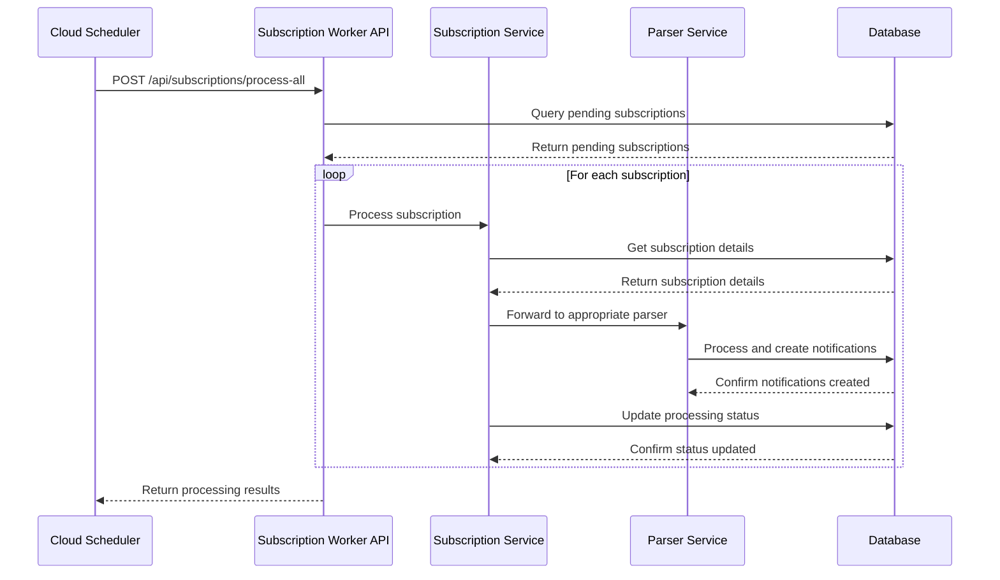

# Scheduled Subscription Processing

This document outlines the automated subscription processing flow implemented for NIFYA.

## Architecture Overview

```mermaid
graph TD
    CS[Google Cloud Scheduler] -->|Scheduled Trigger| EP[/api/subscriptions/process-all Endpoint]
    EP -->|Process Request| SC[Subscription Controller]
    SC -->|Fetch Pending Subscriptions| DB[(Database)]
    SC -->|Process Each Subscription| SS[Subscription Service]
    SS -->|Get Subscription Details| DB
    SS -->|Send to Appropriate Parser| PS[Parser Services]
    PS -->|Process Content| PS
    PS -->|Create Notifications| DB
    SS -->|Update Processing Status| DB
```

## Workflow Process

1. **Google Cloud Scheduler** triggers the subscription processing at scheduled intervals (e.g., daily at 3 AM)
2. **Subscription Worker `/api/subscriptions/process-all` Endpoint** receives the HTTP POST request
3. **Subscription Controller** handles the request by:
   - Fetching all pending subscriptions from the database
   - Processing each subscription in batches to avoid overloading the system
4. For each subscription:
   - The **Subscription Service** retrieves subscription details
   - It identifies the appropriate parser based on subscription type
   - It forwards the subscription to the parser service
   - The parser processes the content and creates notifications directly in the database
   - The subscription processing status is updated in the database

## Implementation Details

The implementation uses the existing backend components with a new endpoint specifically designed for scheduled processing:

### New Endpoint

```
POST /api/subscriptions/process-all
```

This endpoint is designed to be called by Google Cloud Scheduler and processes all pending subscriptions in the system.

### Cloud Scheduler Configuration

To set up the scheduled job in Google Cloud Scheduler:

1. Create a new job in Google Cloud Scheduler
2. Set the frequency using cron syntax (e.g., `0 3 * * *` for daily at 3 AM)
3. Configure the HTTP target:
   - URL: `https://subscription-worker-415554190254.us-central1.run.app/api/subscriptions/process-all`
   - HTTP Method: `POST`
   - Auth Header: Add appropriate authentication if needed

## Advantages of This Approach

1. **Simplicity**: Leverages existing infrastructure without requiring complex scheduler code
2. **Reliability**: Google Cloud Scheduler provides reliable triggering with retry capabilities
3. **Scalability**: The subscription worker can handle processing in batches to manage load
4. **Monitoring**: Both Cloud Scheduler and the subscription worker provide logs for monitoring

## Sequence Diagram



## Error Handling

The implementation includes comprehensive error handling:

1. **Individual Subscription Failures**: If processing an individual subscription fails, the error is logged, the subscription is marked as failed, and processing continues with other subscriptions.

2. **Complete Job Failure**: If the entire job fails (e.g., database connection issues), appropriate error responses are returned to Cloud Scheduler, which will retry according to its configuration.

3. **Logging**: All errors are logged with full context and trace IDs for debugging.

## Future Enhancements

Potential future enhancements to the scheduled processing:

1. **Improved Batching**: Enhance the batching mechanism to process subscriptions in parallel with controlled concurrency
2. **Time Window Processing**: Add ability to process subscriptions based on specific time windows
3. **Priority Queuing**: Implement priority-based processing for different subscription types
4. **Status Dashboard**: Create a monitoring dashboard for scheduled processing statistics 